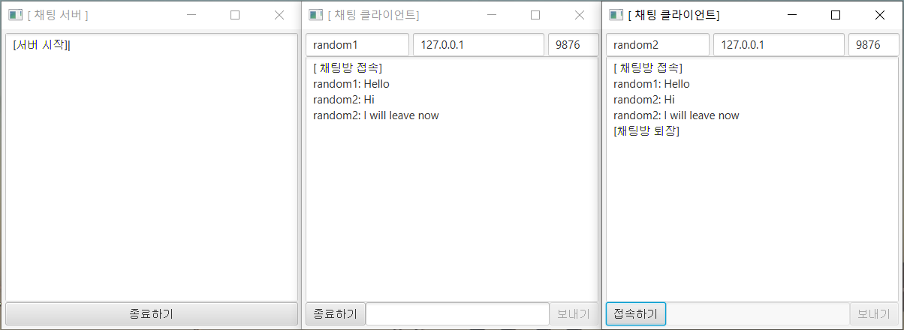

# JavaFx-GUI-Chatting-Program

This is a chatting program based on JavaFx. Users can communicate in one chat room. 

### Screenshots

## Authors
Injun Son

## Acknowledgments
This is the program that I tried to practice Java and the code is based on below video.
https://www.youtube.com/watch?v=4pJwEfpMvjc&list=PLRx0vPvlEmdBtvcSqVkjeL1MwSfRLENYc&index=5
